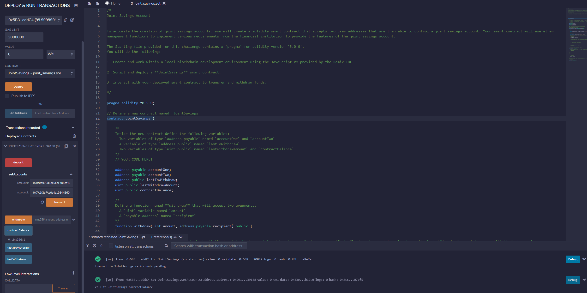
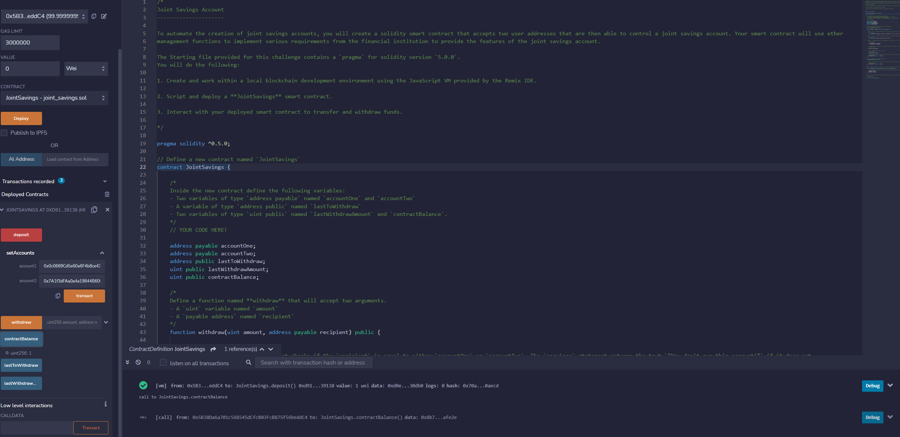
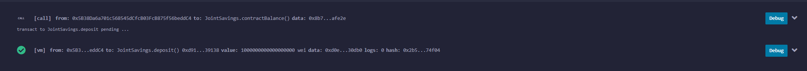
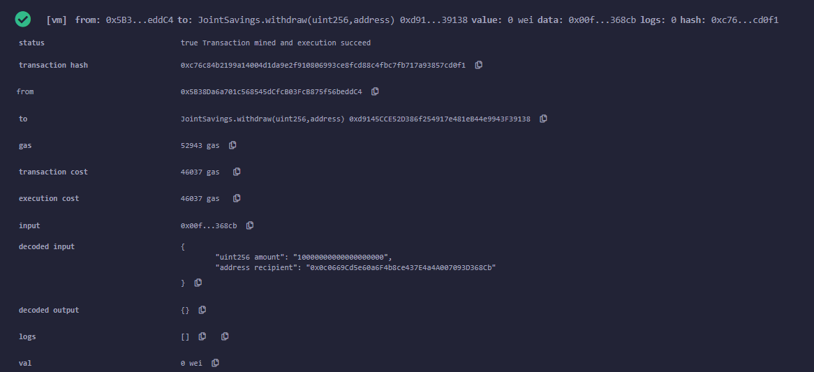
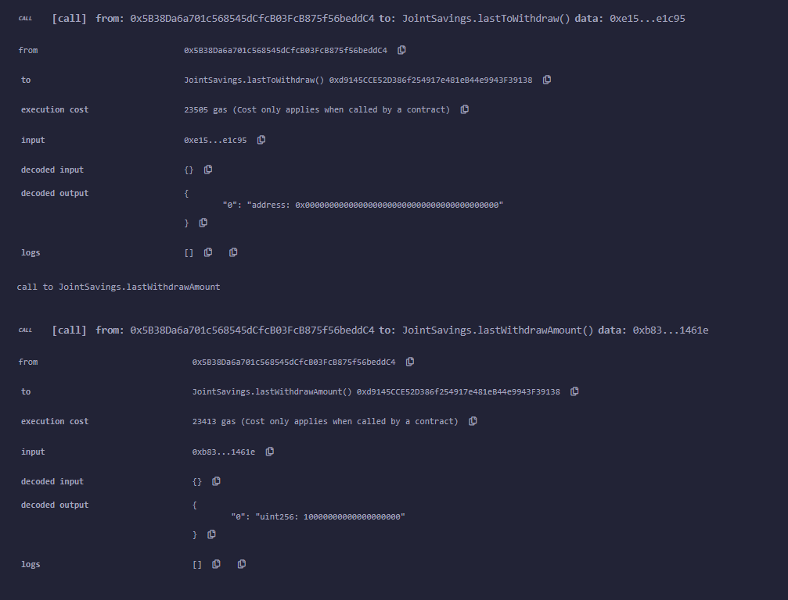

# Fintech-Solidity

## Overview

In this repo is an ethereum smart contract written on remix.ethereum.org detailing a joint savings account. 
This contract enables you to deposit ETH as wei, gwei, finney and ether and display the quantities. It also enables you to withdraw ether in either accounts.

## Execution Results

### Deploy  

## Wei Transaction  

### 5 Eth Deposit
  

### 10 Eth Deposit

### 10 Eth Withdraw

### Contract Balance
  

### Last to Withdraw

